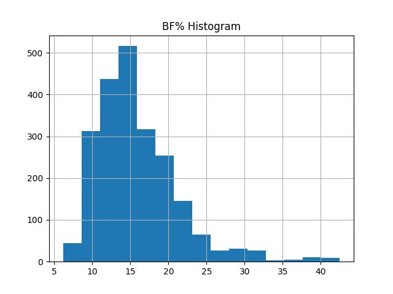
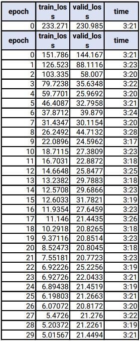

# Body fat predictor

Code for body fat predictor, which can be found here: 
https://huggingface.co/spaces/SegevC/bf_predictor.

### Setup
To install the required libraries in this repo, run:
```
pip install -r requirements.txt
```

### Extracting the data
We begin by scraping the subreddit "guessmybf". 
We go over posts that contain photos, download them, and save any relevant data from the post in a CSV file (for example, we save comments for a given post, post scores, author identifiers, and so on) - This is done via the scrape_from_reddit method in the file "reddit_bf_scraping.py".
As a result, we have about 1800 photos that have been labeled by the members of the "guessmybf" subreddit.

In order to run this script make sure that you have a client id, client secret and user agent provided by reddit 
those are defined as environment variable named 'CLIENT_ID', 'CLIENT_SECRET' and 'USER_AGENT' in the file 
'reddit_bf_scrapping.py'. Also in order to guarantee that all photos are properly downloaded using the 
get_photos_from_post in method in image_parsing_utils.py one should also have a client imgur id provided by imgur.com
this is defined as environment variable named 'CLIENT_IMGUR_ID' in the file 
'image_parsing_utils.py'.

### Cleaning odd data - Part I
After an initial cleanup of the raw data (e.g. deleting comments 
which obviously don't refer to the post bf%). We divide all photos into 
different folders - given by the  range a certain picture fall into, e.g. pictures
of users who were deemed to have 13% bf are put in a folder named "11-14.9%" and pictures
of users who were deemed to have 6% are  put in a folder named "3.0-6.9" and so on..
We then quickly  go over this data with our eyes to check for abnormalities 
(for example, we check for people in the highest and lowest bf% and see if there are 
any pictures which were misclassified).
We then look and the data's distribution, and see if it indeed makes sense



and indeed a quick check in the internet yields a similar trend to the one we 
know bf% distributes in the general western population 

### Constructing a datablock
An important note to consider is how to divide the various photos we have into train and dev
sets -- as many reddit users upload more than a single photo, we don't want to have a situation
in which we have 2 photos of the same person, one in the training set and one the test set.
In order do solve this problem we spilt our data based on a user's ID, based on the csv file
we got from the previous part.

### Training an initial model and cleaning odd pictures
Now that we have an initial data to work with, we use transfer learning on the resnet34
NN for 30 epochs using a learning rate of 1e-2 (this lr was chosen using the lr_find() 
method from fastai) - The loss is measured by MSE.

 

In retrospect, it might have been better to train it much less epochs. We now use this trained NN, to find anomalies in our data. 
And indeed after checking the model's prediction on the training set we have 112 instances
in which the model's prediction was off at about 4%. Going over those anomalies we see
that 41 of them should not be considered as part of the training data - (e.g. pictures
of dexa scans, of a single limb etc..).

### Checking different models
After we removed some abnormal pictures, we tried to use different image models 
from the timm library (which provides pre-trained computer vision models). 
In the following link https://www.kaggle.com/code/jhoward/which-image-models-are-best/
one can see in which way the different types of models differ.
I tried to use the following architectures:
'resnet34' 'resnet50', 'levit_384', 'levit_256', each were trained on varying epochs from 
30 all the way to 50, with a learning that was suggested by the lr_find() function which 
fastai provide. In the end the best model was the resnet34 model which was trained for 
30 epochs This model gave a MSE of 20, whereas the rest gave a MSE of about 30 at best.
We saved the different finetuned models which were trained for 30 epochs, The models 
that were train on 50 epochs actually did worse then the ones who were trained for 30 epochs.

### Improving the model

